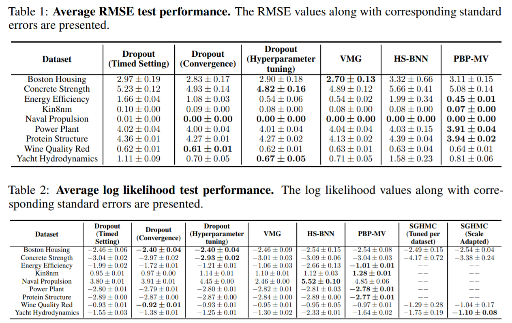
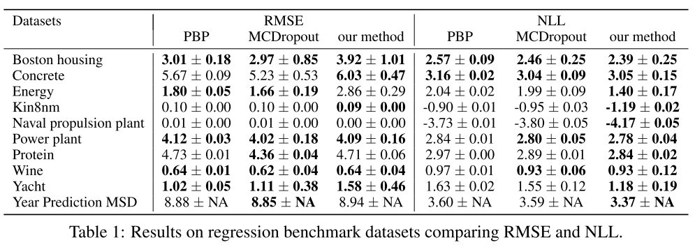
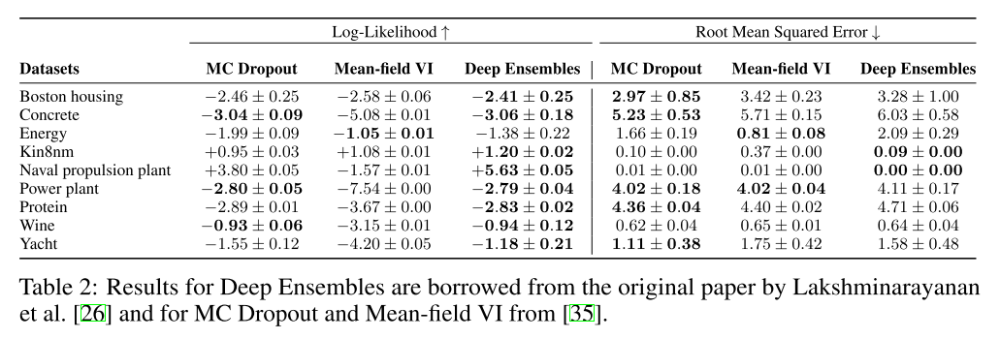

# Validación y métricas de estimación de la incertidumbre

En esta página se pretende hacer una revisión del estado del arte de los siguientes puntos:

* [Medidas y/o interpretación de incertidumbre](#medidas)
* [Métricas de validación o scoring de la incertidumbre](#metricas)
* [Baselines y benchmarks de referencia](#benchmarks)

### Contexto 

Es necesario realizar esta revisión en los siguientes puntos:

* Encontrar unas medidas de incertidumbre que sean fácilmente interpretables
* Entender los motivos de la elección de una medida de incertidumbre u otra
* Establecer una metodología de validación de la calidad que nos sirva para comparar distintas técnicas
* Establecer un baseline (o modelo de referencia) como punto de partida para realizar la comparativa

El **objetivo** que se persigue es:

Extraer una **metodología para comparar distintas técnicas**. Dar unas pautas en la elección de la medida de incertidumbre o técnica a usar

### Medidas e interpretación de la incertidumbre

En Medidas de Incertidumbre e Interpretación se exponen las medidas de incertidumbre comúnmente utilizadas tanto para la definición de la función de pérdida como para validar la calidad de medición de la incertidumbre. 

Se ha visto que para problemas de regresión se utiliza la varianza o RMSE y para problemas de clasificación la entropía o cross-entropy. 

Las posibles variaciones y/o adaptaciones en el uso e interpretación de las medidas de incertidumbre dependen principalmente de la aplicación o caso de uso de esta con los siguientes criterios:

* **Selección del prior** (e.g. se utiliza una distribución de partida que se cree que se puede ajustar mejor al problema)
* **Aproximación de la función de pérdida** (e.g. variational bayes, laplace approximation)

*Referencias*

[1] https://towardsdatascience.com/bayesian-deep-learning-with-fastai-how-not-to-be-uncertain-about-your-uncertainty-6a99d1aa686e

[2] https://arxiv.org/pdf/1803.08533.pdf

    

### Métricas de Validación o Scoring 

En Métricas de Validación o Scoring se ha hecho una revisión de las métricas utilizadas para validar la calidad de las estimaciones de incertidumbre.

Se ha visto que la más utilizadas son RMSE (regresión) y NLL (Negative Log-Likelihood). Es de especial importancia utilizar las dos debido a las restricciones que RMSE impone en cuanto al tipo de distribución (gaussiana)

Se han extraído algunas ideas para la validación de calidad o scoring:

* Generación de ejemplos adversarios 
* Cross Validation 
* Eliminación recursiva de predicciones que superen un cierto nivel de incertidumbre K

Métricas de Calibración

* Brier Score
* Classical Reliability Diagrams
* Expected Calibration Error (ECE) 

Se ha visto que también es importante los siguientes aspectos:

* Asegurar una buena calibración del modelo.
* Tener un juego de datasets reales con diferentes características

*Referencias*

[3] https://arxiv.org/pdf/1307.5928.pdf

### Benchmarks de referencia

Se han extraído 3 benchmarks de referencia 
Se han extraído datasets reales de referencia para construir un conjunto de pruebas
Se han extraído los siguientes modelos de referencia:
* MonteCarlo Dropout
* Variational Inference
* DeepEnsembles

***Referencia**: On the Importance of Strong Baselines in Bayesian Deep Learning*

***Referencia**: Lakshminarayanan, B., Pritzel, A., & Blundell, C. (2017). Simple and scalable predictive uncertainty estimation using deep ensembles. Advances in Neural Information Processing Systems, 2017-Decem(Nips), 6403–6414*

***Referencia**: Filos, A., Farquhar, S., Gomez, A. N., Rudner, T. G. J., Kenton, Z., Smith, L., … Gal, Y. (2019). A Systematic Comparison of Bayesian Deep Learning Robustness in Diabetic Retinopathy Tasks. (NeurIPS), 1–12. Retrieved from http://arxiv.org/abs/1912.10481*

